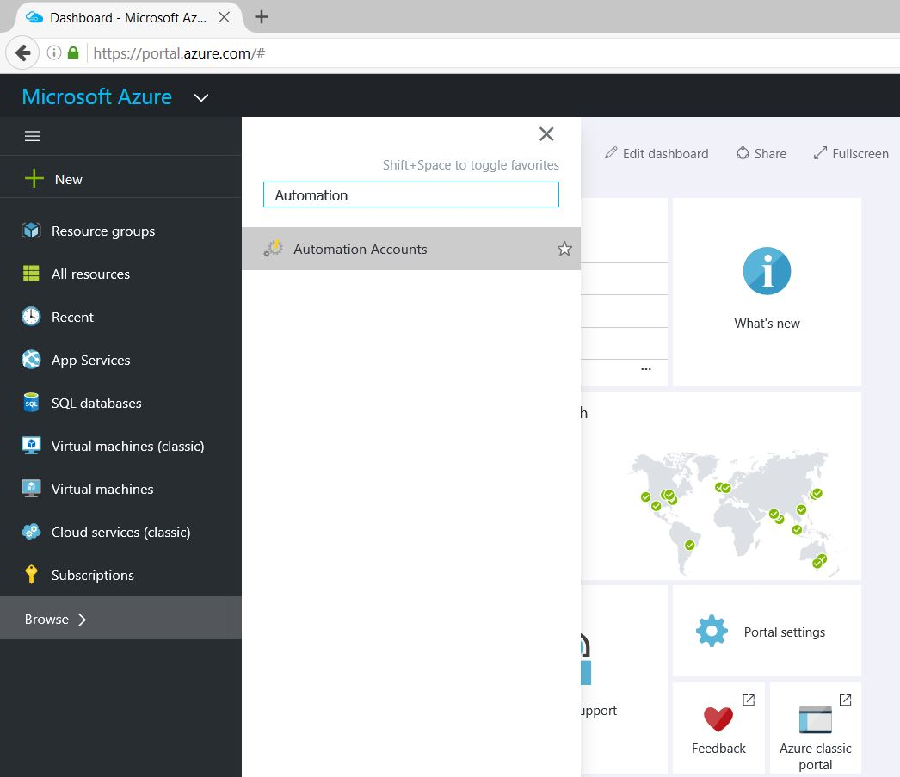
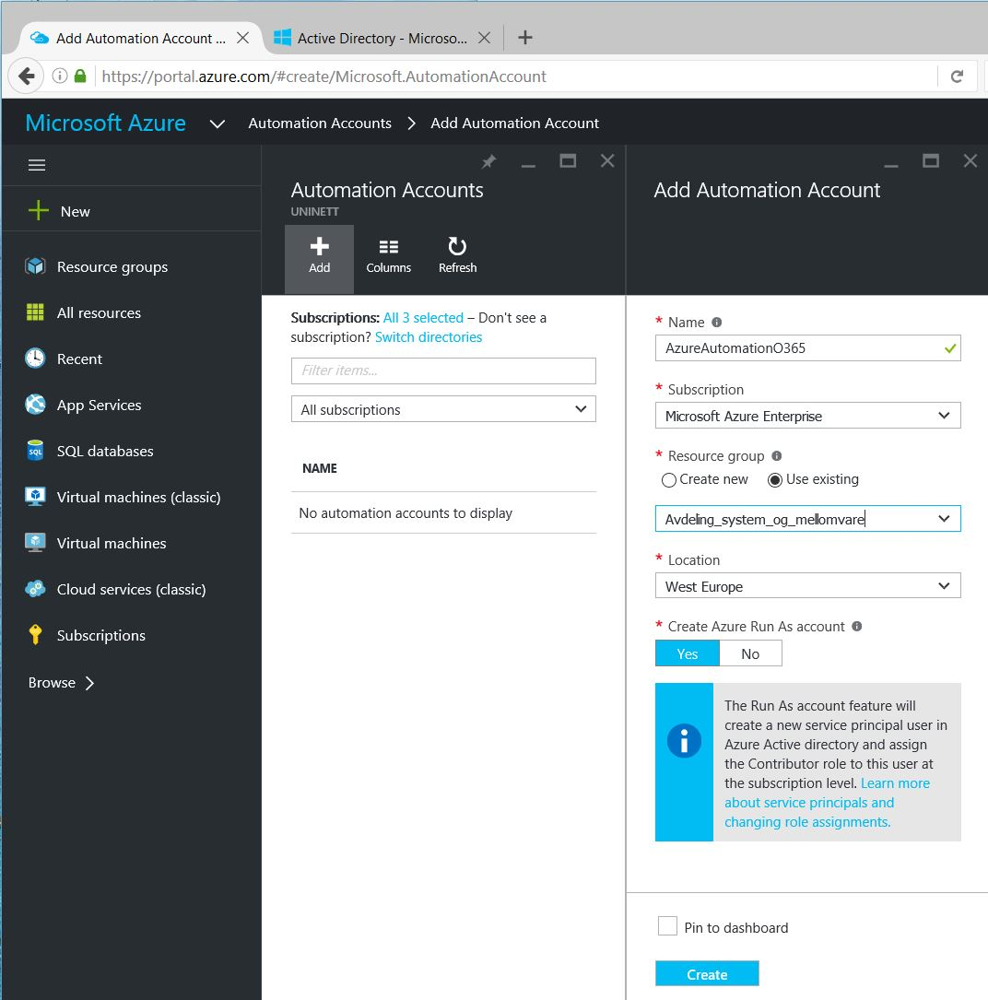
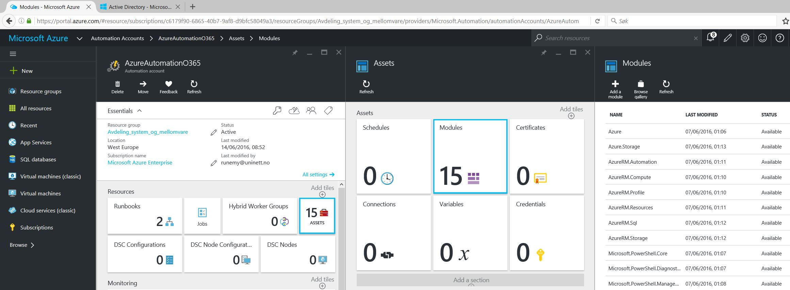
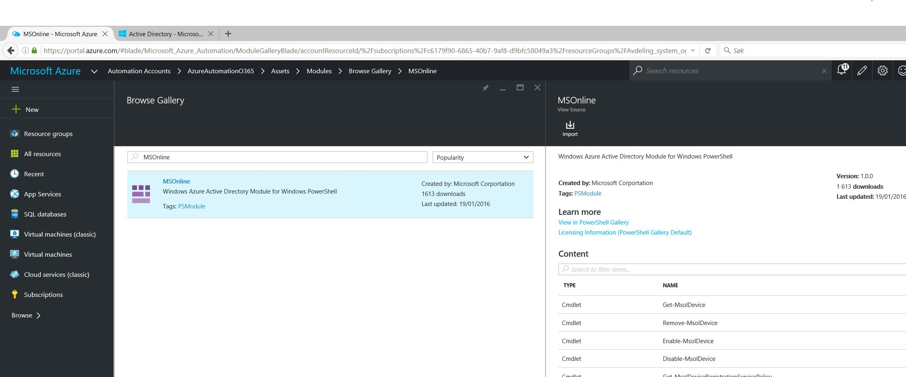
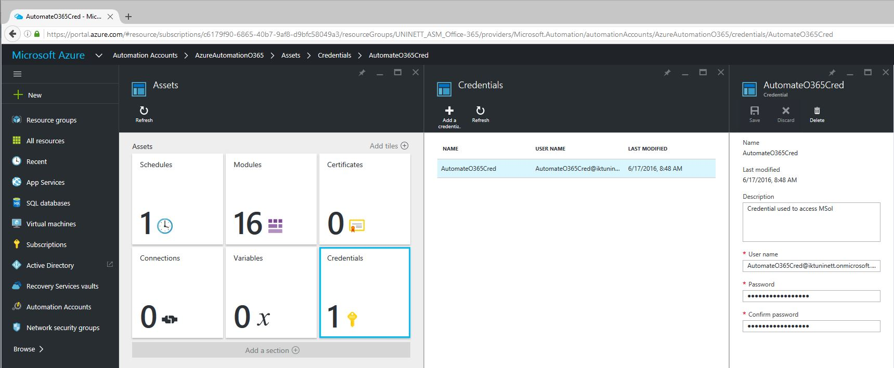
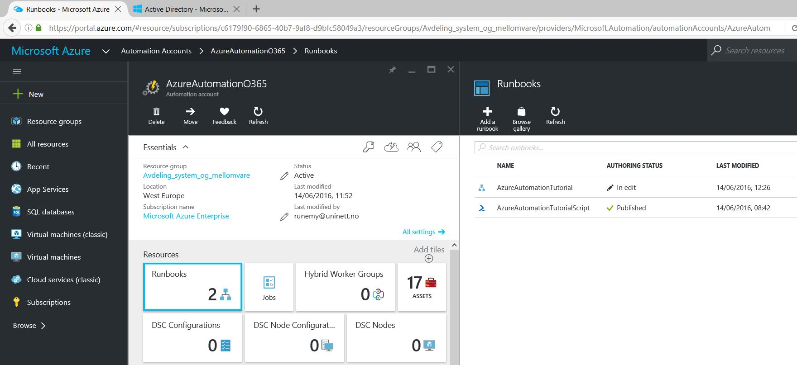
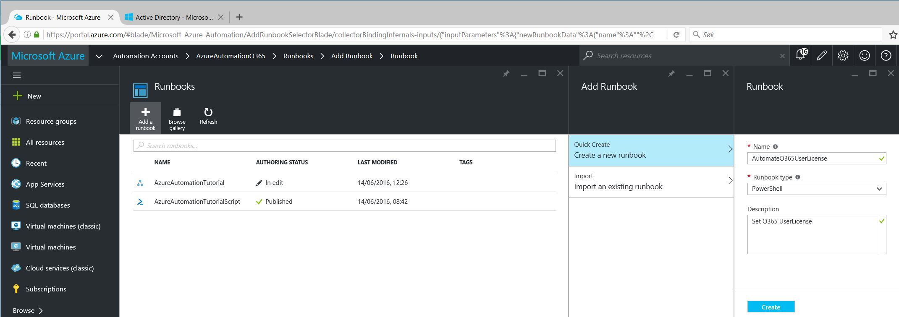
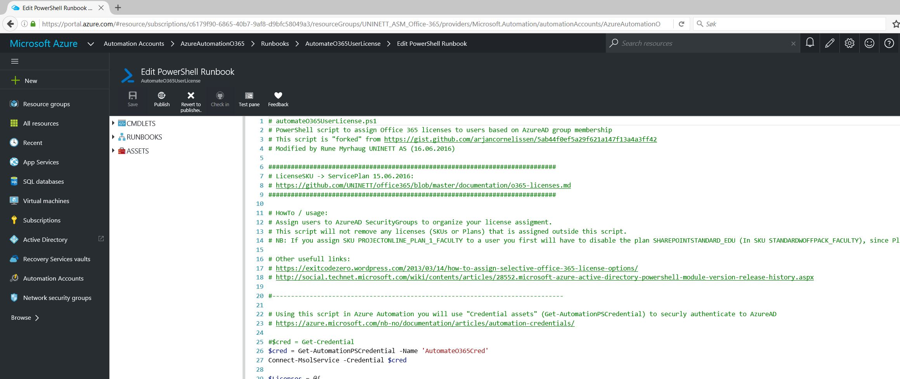
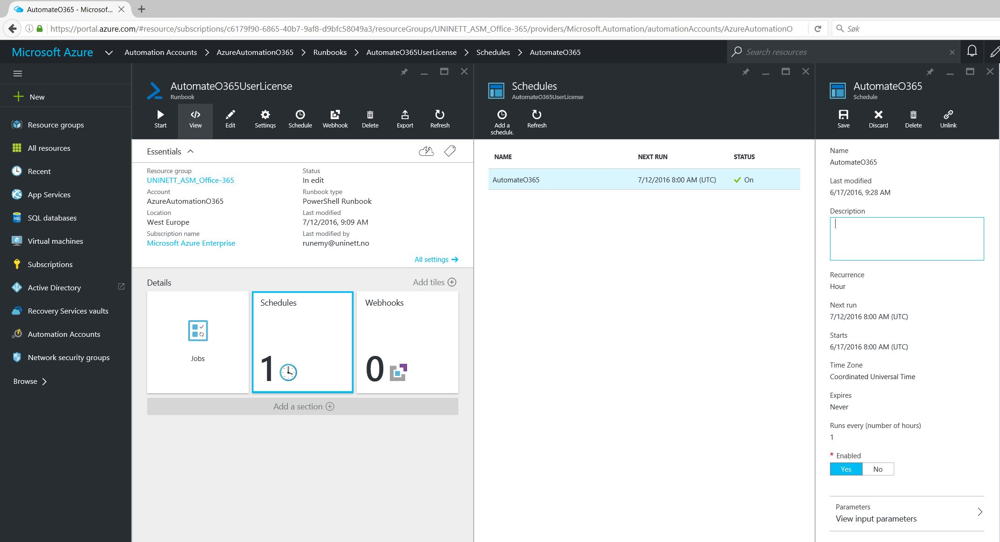

# Azure Automation #

- https://azure.microsoft.com/en-gb/services/automation/
- https://azure.microsoft.com/en-us/documentation/articles/automation-intro/
- https://blogs.msdn.microsoft.com/microsoft_press/2015/03/06/free-ebook-microsoft-azure-essentials-azure-automation/

A runbook is a set of tasks that perform some automated process in Azure Automation. Runbooks in Azure Automation are based on Windows PowerShell or Windows PowerShell Workflow, so they do anything that PowerShell can do. If an application or service has an API, then a runbook can work with it.

## Automating Office 365 ##

This description is based on:
- http://www.microsofthelden.nl/2016/05/16/managing-office-365-with-azure-automation/ 
- https://gist.github.com/arjancornelissen

With many users in Office365 you will have to automate different tasks:
- Assign licenses to users
- Set the Location attribute on users.
- Activate archiving
- ++

Azure Automation can do this!

To get started with Azure automation for Office 365 we need three things; PowerShell knowledge, a Azure subscription and an Office 365 subscription.

### O365 User License ###

- Go to: https://portal.azure.com
- Click "Browse" and search for "Automation Accounts"

- Click "Add" to create a new "Automation Account" with name "AzureAutomationO365"

`Resource groups provide a way to monitor, control access, provision and manage billing for collections of assets that are required to run an application, or used by a client or company department. Azure Resource Manager (ARM) is the technology that works behind the scenes so that you can administer assets using these logical containers.`

- Click on "Assets" -> "Modules" -> "Browse gallery"

- Search for and select "MsOnline" -> Import -> OK

Create a user (AutomateO365Cred@<tenant>.onmicrosoft.com) in AzureAD with "Global Admin" role assigned. This can be done by using Powershell script:
- https://github.com/UNINETT/office365/blob/master/powershell/createAzureADGlobalAdmin.ps1

Back in Azure Automation -> Click "Credentials" -> Add a credential -> Enter username and password for the user (AutomateO365Cred@<tenant>.onmicrosoft.com) created in AzureAD.

Click "Runbooks" -> "Add a runnbook" -> Quick create "Create a new runbook", with runbook type "powershell" and name: AutomateO365UserLicense

This PowerShell script: https://github.com/UNINETT/office365/blob/master/powershell/automateO365UserLicense.ps1
Could be used to automate O365 User License assignment. The script is based on AzureAD Security Groups. The script sets the "User Location" attribute (required to assign licenses) and then sets selected O365 licenses on the users that is populated in the security groups.

Each runbook has a Draft and a Published version. Only the Published version is available to be run, and only the Draft version can be edited. The Published version is unaffected by any changes to the Draft version. When the Draft version should be made available, then you publish it which overwrites the Published version with the Draft version.

When the runbook is published you have to activate Scheduling to run the script eg. each hour.

 

