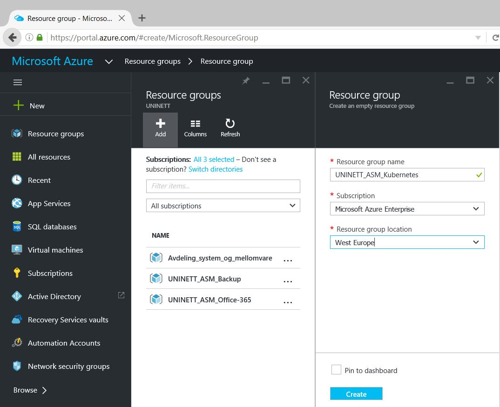

# Google Kubernetes #

http://kubernetes.io/

`Kubernetes is an open-source system for automating deployment, scaling, and management of containerized applications.`

Kubernetes is not a module in Azure -> This is how you can setup a Kubernetes cluster in Azure.

## Running Kubernetes on Azure ##

### Create & Configure Linux Management Server/VM ###

First create & configure a Linux Server/VM that you can use to manage your Kubernetes Cluster.
This Server/VM can be on-premises (Physical HW or hypervisor) or on Azure VM (Or another public cload platform).

I choose to create a Debian 8.0 Jessie Linux VM on a on-premises HyperV-Cluster.

#### Install Docker ####

https://docs.docker.com/v1.8/installation/debian/#debian-jessie-80-64-bit

	$ sudo apt-get update
	$ sudo apt-get install docker.io

#### Install JQ ####

	apt-get install jq

#### Install NodeJs ####

https://nodejs.org/en/download/package-manager/#debian-and-ubuntu-based-linux-distributions

	curl -sL https://deb.nodesource.com/setup_6.x | sudo -E bash -
	sudo apt-get install -y nodejs

#### Install & Configure Kubectl ####

https://coreos.com/kubernetes/docs/latest/configure-kubectl.html

	$ curl -O https://storage.googleapis.com/kubernetes-release/release/v1.2.4/bin/linux/amd64/kubectl
	$ chmod +x kubectl
	$ mv kubectl /usr/local/bin/kubectl
	
### Prepare Azure ###

https://portal.azure.com/

Create a new Resource group to contain your Kubernetes cluster.

`Resource groups provide a way to monitor, control access, provision and manage billing for collections of assets that are required to run an application, or used by a client or company department. Azure Resource Manager (ARM) is the technology that works behind the scenes so that you can administer assets using these logical containers.`

Find the Subscription ID:

Find your AzureAD Tenant ID:

http://merill.net/2015/01/how-to-get-the-azure-ad-tenant-id-without-powershell/

### Flannel-based ###

http://kubernetes.io/docs/getting-started-guides/azure/

#### Export variables ####

	root@azure-kube:~# export KUBERNETES_PROVIDER=azure
	root@azure-kube:~# export AZURE_SUBSCRIPTION_ID="c6179f90-6865-40b7-9af8-d9bfc58049a3"
	root@azure-kube:~# export AZURE_TENANT_ID="68763e3d-4615-4222-988f-90ba13e351e9"
	root@azure-kube:~# export AZURE_RESOURCE_GROUP="UNINETT_ASM_Kubernetes"
	root@azure-kube:~# export AZURE_LOCATION="westeurope"

#### Download Kubernetes ####

	root@azure-kube:~# curl -sS https://get.k8s.io | bash
	Downloading kubernetes release v1.3.0 to /root/kubernetes.tar.gz
	converted 'https://storage.googleapis.com/kubernetes-release/release/v1.3.0/kubernetes.tar.gz' (ANSI_X3.4-1968) -> 'https://storage.googleapis.com/                                                                                          kubernetes-release/release/v1.3.0/kubernetes.tar.gz' (UTF-8)
	--2016-07-12 13:51:36--  https://storage.googleapis.com/kubernetes-release/release/v1.3.0/kubernetes.tar.gz
	Resolving storage.googleapis.com (storage.googleapis.com)... 2a00:1450:400f:808::2010, 209.85.233.128
	Connecting to storage.googleapis.com (storage.googleapis.com)|2a00:1450:400f:808::2010|:443... connected.
	HTTP request sent, awaiting response... 200 OK
	Length: 1486828686 (1.4G) [application/x-tar]
	Saving to: 'kubernetes.tar.gz'
	
	kubernetes.tar.gz                    100%[=======================================================================>]   1.38G  58.5MB/s   in 18s
	
	2016-07-12 13:51:55 (77.9 MB/s) - 'kubernetes.tar.gz' saved [1486828686/1486828686]
	
	Unpacking kubernetes release v1.3.0
	Creating a kubernetes on azure...
	... Starting cluster using provider: azure
	... calling verify-prereqs
	... calling kube-up
	++> AZURE KUBE-UP STARTED: Tue Jul 12 13:52:41 CEST 2016
	This will be interactive. (export AZURE_AUTH_METHOD=client_secret to avoid the prompt)
	hyperkube-amd64:v1.3.0 was found in the gcr.io/google_containers repository
	FATA[0000] cannot enable tty mode on non tty input

This one failes on authentication. 

#### Start Kube-up ####

	root@azure-kube:~# cd kubernetes/cluster
	root@azure-kube:~/kubernetes/cluster# ./kube-up.sh
	... Starting cluster using provider: azure
	... calling verify-prereqs
	... calling kube-up
	++> AZURE KUBE-UP STARTED: Tue Jul 12 13:54:42 CEST 2016
	This will be interactive. (export AZURE_AUTH_METHOD=client_secret to avoid the prompt)
	hyperkube-amd64:v1.3.0 was found in the gcr.io/google_containers repository
	Unable to find image 'colemickens/azkube:v0.0.5' locally
	v0.0.5: Pulling from colemickens/azkube
	9b6bb6833201: Pull complete
	17598223c915: Pull complete
	5c7358615129: Pull complete
	6363b3ae1157: Pull complete
	2655c2e7835c: Pull complete
	Digest: sha256:0f9867e2ccb9197ea1b4e93958f8cda85e66e16ed1a0930ce0f4b09a25d68547
	Status: Downloaded newer image for colemickens/azkube:v0.0.5
	WARN[0000] --resource-group is unset. Derived one from --deployment-name: "kube-20160712-135442"
	WARN[0000] --master-fqdn is unset. Derived one from input: "kube-20160712-135442.westeurope.cloudapp.azure.com".
	To sign in, use a web browser to open the page https://aka.ms/devicelogin. Enter the code CNUHED3T2 to authenticate.
	^Croot@azure-kube:~/kubernetes/cluster# ./kube-up.sh
	... Starting cluster using provider: azure
	... calling verify-prereqs
	... calling kube-up
	++> AZURE KUBE-UP STARTED: Tue Jul 12 13:56:16 CEST 2016
	This will be interactive. (export AZURE_AUTH_METHOD=client_secret to avoid the prompt)
	hyperkube-amd64:v1.3.0 was found in the gcr.io/google_containers repository
	WARN[0000] --resource-group is unset. Derived one from --deployment-name: "kube-20160712-135616"
	WARN[0000] --master-fqdn is unset. Derived one from input: "kube-20160712-135616.westeurope.cloudapp.azure.com".
	To sign in, use a web browser to open the page https://aka.ms/devicelogin. Enter the code C8HQZZAR5 to authenticate.

In a web-browser (On your PC/or any device) open the URL https://aka.ms/devicelogin

Click "Continue" and then you will be asked to authenticate with your Azure user.

INFO[0072] Starting ARM Deployment. This will take some time. deployment="kube-20160712-135616-1468324651"

### Weave-based ###

http://kubernetes.io/docs/getting-started-guides/coreos/azure/